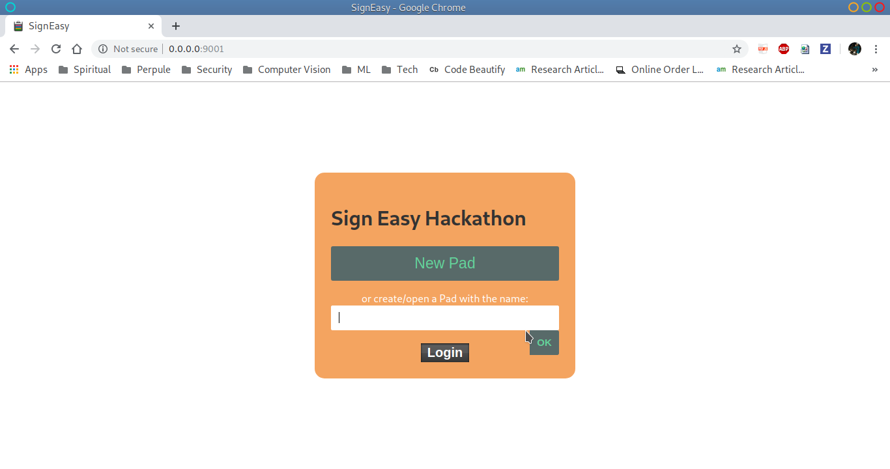
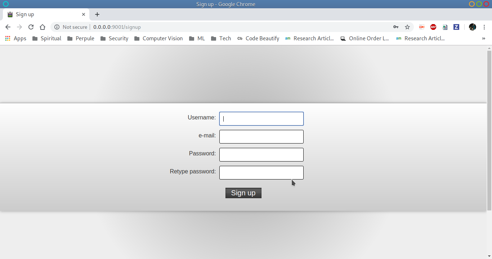
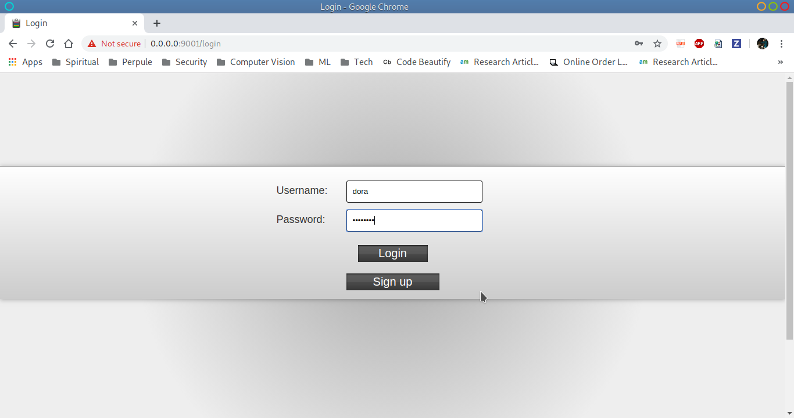
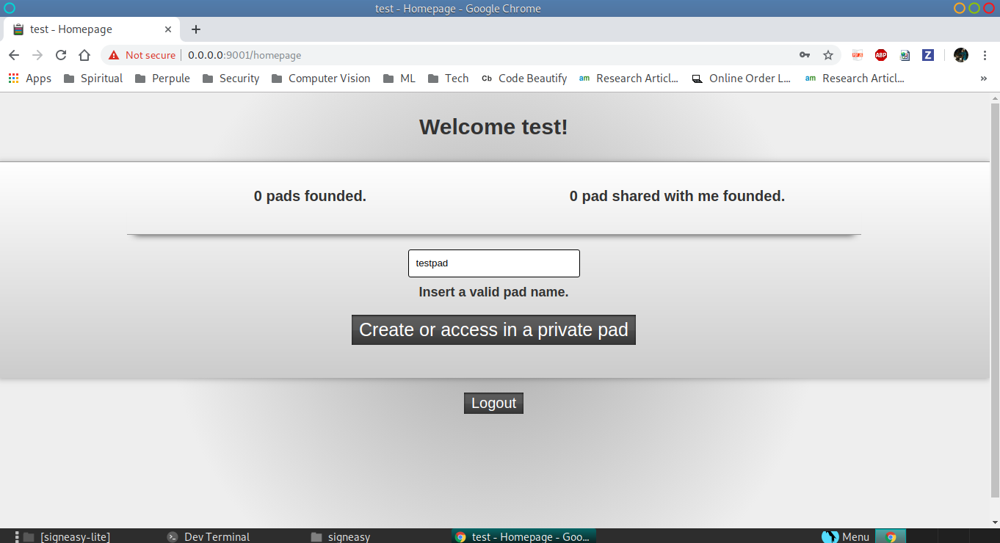
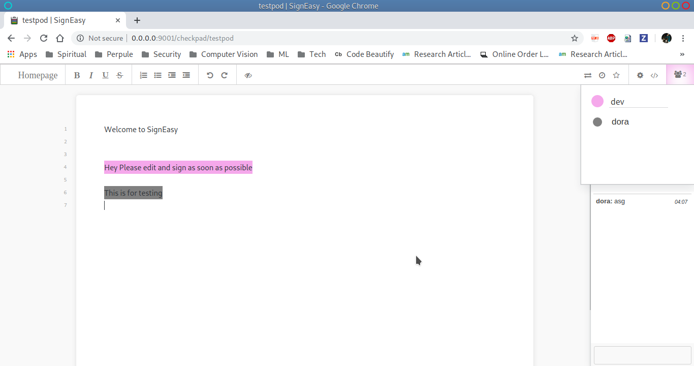

# A real time collaborative word editor for the web
- Home

- Signup

- Login

- Dashboard

- Edit Text
 

# Steps to run
1) clone code
2) run `signeasy-server/bin/run.sh` and open <http://127.0.0.1:9001> in your browser.
3) Code at root level of folder is django client for above 
   a) virtualenv venv
   b) source venv/bin/activate
   c) pip install -r requirements.txt
   d) python manage.py makemigrations etherpadlite
   e) python manage.py migrate
   f) python manage.py createsuperuser
   g) python manage.py runserver

4) Once you have done this, you will need to, at minimum, create a group and add a first etherpad-lite server via the django admin interface in order to take full advantage of this modules functionality:
    Add a group: admin/auth/group/add/
    Add an etherpad server: admin/etherpadlite/padserver/add/
    Add an etherpad group corresponding to the auth group: admin/etherpadlite/padgroup/add/

5) Code deployed at https://signeasy1.azurewebsites.net/ . Css and js files are not properly in azure, but works properly on localhost and sometimes azure give quota limit exceeded , due to which it is not able to serve as azure credits are very less given during hackathon

